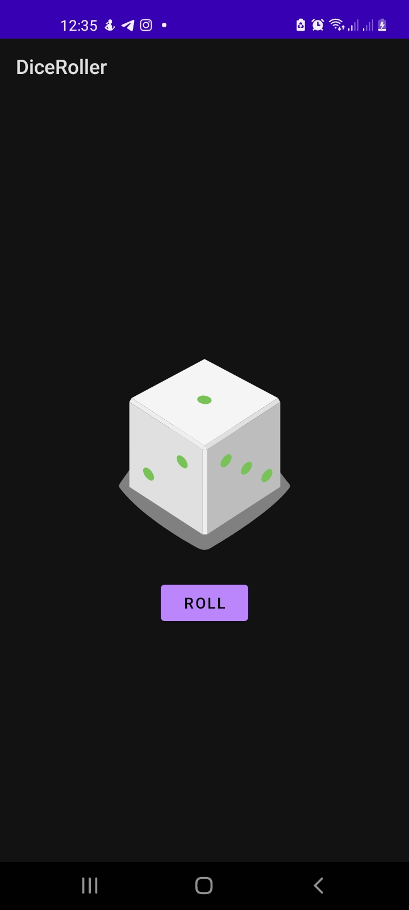

# Dice Roll Application

- This android app is used for rolling dice

---
## preview

---

---
**Version1.0.0**

---

---
## Authors
- Nicholas Barkote <nicholas.kebut@student.moringaschool.com>
---


# Tech Stack

- Android
- Kotlin


## Setup Instructions

* clone it to your desktop
```bash
 git clone  https://github.com/barkotenicholas/Quotes.git
  ```
 - then open with android studio


## Contact Information

<a href="mailto:barkotenicholas@gmail.com">barkotenicholas@gmail.com</a>


## License & copyright

© Nicholas k Barkote , Moringa school student

Licensed under the [MIT License](LICENSE)